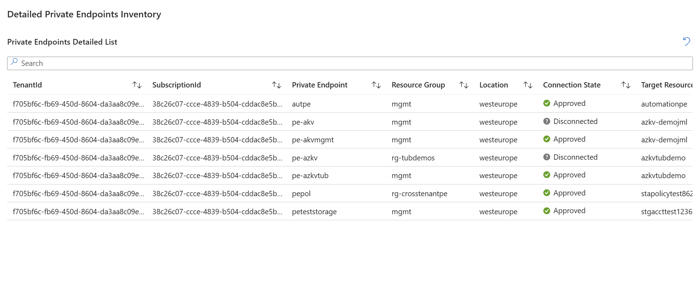
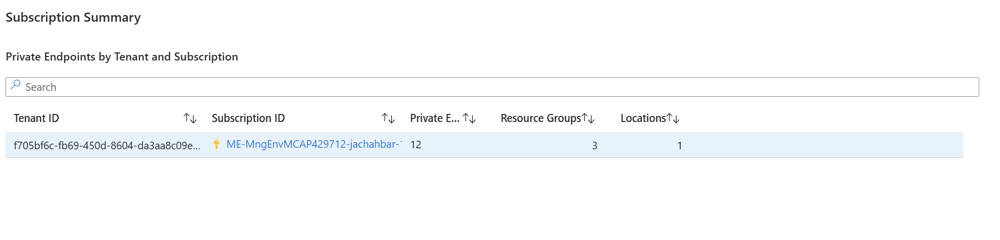

# Azure Private Endpoints Inventory Workbook

A comprehensive Azure Workbook for monitoring and managing Private Endpoints across subscriptions and tenants, designed for enterprise environments including Financial Services institutions.

## Overview

This workbook provides complete visibility into Private Endpoint configurations across your Azure environment, enabling security teams, network administrators, and compliance officers to track and audit private connectivity.

### Screenshots


*Dashboard overview showing total counts and distribution*


*Private Endpoints distribution by location and connection state*


*Detailed Private Endpoints inventory with all configuration details*


*Cross-subscription and cross-tenant connection analysis*


*Tenant and subscription summary with aggregated metrics*

## Features

### Multi-Tenant & Multi-Subscription Support
- **Cross-subscription visibility**: View Private Endpoints across all subscriptions in your tenant
- **Cross-tenant analysis**: Identify Private Endpoints connecting to resources in different tenants
- **Dynamic filtering**: Filter by subscription and resource group

### Comprehensive Inventory Views
1. **Overview Statistics**: Total counts, subscription distribution, resource group summary
2. **Location Analysis**: Geographic distribution of Private Endpoints
3. **Connection State Monitoring**: Track approval status (Approved, Pending, Rejected)
4. **Detailed Inventory**: Complete Private Endpoint details including:
   - Target resource information
   - Network configuration (VNet, Subnet, NIC)
   - Connection state and group IDs
   - Tenant and subscription metadata

### Advanced Analytics
- **Target Resource Type Analysis**: Breakdown by Azure service type
- **Cross-Subscription Connections**: Identify Private Endpoints connecting across subscription boundaries
- **IP Configuration Details**: Network interface and IP allocation information
- **Tenant & Subscription Summary**: Aggregated metrics per tenant/subscription

## DORA Compliance Considerations

### Digital Operational Resilience Act (DORA) Alignment

This workbook supports DORA compliance requirements for Financial Services Institutions (FSI) in the following areas:

#### Article 6 & 7: ICT Risk Management Framework
⚠️ **Partial Support - Network Segmentation Visibility**: Provides *visibility* of private connectivity patterns but does NOT enforce segmentation policies
⚠️ **Partial Support - Asset Inventory**: Provides *current state snapshot* but lacks automated continuous inventory management, change history, or alerting
⚠️ **Partial Support - Configuration Management**: Shows *current configurations* but does NOT track changes over time, approvals, or configuration drift

#### Article 9: Protection and Prevention
⚠️ **Partial Support - Network Security Monitoring**: Shows *current* connection states but does NOT provide real-time monitoring, alerting, or prevention
⚠️ **Partial Support - Cross-Tenant Detection**: Can *identify* cross-tenant connections but does NOT prevent, alert, or enforce policies
❌ **Not Supported - Audit Trail**: This is a read-only view; audit trails require Azure Activity Logs and separate retention/archival

#### Article 10: Detection
⚠️ **Partial Support - Anomaly Detection**: Provides data for *manual* review but does NOT perform automated anomaly detection or alerting
⚠️ **Partial Support - Unauthorized Access Detection**: Shows rejected/pending states but does NOT detect in real-time or alert

#### Article 11: Response and Recovery
⚠️ **Partial Support - Impact Assessment**: Helps with *manual* impact assessment during incidents but does NOT automate assessment or response
⚠️ **Partial Support - Dependency Mapping**: Shows connections but lacks dynamic dependency graphs, blast radius analysis, or recovery sequencing

#### Article 28: ICT Third-Party Risk Management
⚠️ **Partial Support - Cross-Subscription Tracking**: Identifies connections but does NOT validate third-party relationships, assess risk, or enforce policies
⚠️ **Partial Support - Service Dependency Visibility**: Shows target services but lacks vendor identification, criticality scoring, or contract linkage

### Compliance Notes

**⚠️ IMPORTANT: This workbook is a READ-ONLY VISIBILITY TOOL**

**What this workbook DOES provide:**
- **Point-in-time snapshot** of Private Endpoint configurations (NOT continuous monitoring)
- **Manual review capability** for connection states (NOT automated detection)
- **Static view** of cross-subscription relationships (NOT dynamic tracking)
- **Data source** for manual audit processes (NOT an audit trail itself)

**What this workbook DOES NOT provide:**
- ❌ Real-time monitoring or alerting
- ❌ Automated threat detection or anomaly identification
- ❌ Historical change tracking or audit trail
- ❌ Policy enforcement or prevention
### REQUIRED Complementary Controls for DORA Compliance

**This workbook alone does NOT meet DORA requirements. You MUST implement:**

1. **Azure Policy** (REQUIRED):
   - Enforce Private Endpoint configurations
   - Prevent non-compliant deployments
   - Automated compliance checking

2. **Azure Monitor Alerts** (REQUIRED):
   - Real-time alerting on connection state changes
   - Automated incident creation
   - Integration with ITSM tools

3. **Azure Activity Logs + Log Analytics** (REQUIRED):
   - Complete audit trail with retention
   - Immutable logging for compliance
   - Integration with SIEM

4. **Azure Sentinel or equivalent SIEM** (REQUIRED):
   - Automated threat detection
   - Correlation across security signals
   - Incident response workflows

5. **Change Management Process** (REQUIRED):
   - Formal approval workflows
   - Risk assessment procedures
   - Rollback capabilities

6. **Documentation & Procedures** (REQUIRED):
   - Network architecture diagrams
   - Data flow documentation
   - Incident response playbooks
   - Regular audit and review procedures

7. **Continuous Monitoring Platform** (REQUIRED):
   - Real-time compliance validation
   - Drift detection
   - Automated remediation
This workbook provides **supporting data** for DORA compliance but is NOT sufficient on its own. It enables manual reviews and point-in-time analysis but lacks the automation, continuous monitoring, alerting, and enforcement capabilities required by DORA.

### Recommended Complementary Controls for Full DORA Compliance

1. **Azure Policy**: Enforce Private Endpoint naming conventions and required tags
2. **Azure Monitor Alerts**: Real-time notifications on connection state changes
3. **Azure Activity Logs**: Audit trail of all Private Endpoint modifications
4. **Azure Sentinel**: SIEM integration for advanced threat detection
5. **Azure Automation**: Automated remediation workflows
6. **Document Management**: Formal documentation of network architecture and data flows

## Installation

### Prerequisites
- Azure subscription with Reader or higher permissions
- Access to Azure Monitor / Workbooks
- Permissions to query Azure Resource Graph across target subscriptions

### Deployment Steps

1. **Download the workbook**:
   ```powershell
   # Clone or download PrivateEndpointsInventory.workbook
   ```

2. **Import to Azure Portal**:
   - Navigate to **Azure Monitor** → **Workbooks**
   - Click **+ New**
   - Click the **Advanced Editor** button (</> icon)
   - Paste the contents of `PrivateEndpointsInventory.workbook`
   - Click **Apply**
   - Click **Done Editing**
   - Click **Save** and provide:
     - Title: Private Endpoints Inventory
     - Subscription, Resource Group, Location
     - Save it in a shared gallery for organizational access

3. **Configure Permissions**:
   - Ensure users have **Reader** access to subscriptions they need to monitor
   - For cross-subscription views, grant **Reader** on all relevant subscriptions

## Usage

### Basic Usage

1. Open the workbook from Azure Monitor → Workbooks
2. Select **Subscriptions** to monitor (default: All)
3. Optionally filter by **Resource Groups**
4. Review the dashboard sections

### Query Testing

Individual queries are available in `PrivateEndpointsQueries.md` for testing in Azure Resource Graph Explorer.

### Common Use Cases

**Security Audit**:
- Review "Cross-Subscription Private Endpoints" section
- Check "Connection State" for Pending or Rejected entries
- Verify Private Endpoints connect only to approved resources

**Network Planning**:
- Use "Private Endpoints by Location" for capacity planning
- Review "Target Resource Type" distribution
- Analyze IP configuration details for subnet planning

**Compliance Reporting**:
- Export "Detailed Private Endpoints Inventory" to Excel
- Use "Subscription Summary" for management reporting
- Filter by Resource Group for application-specific reports

## Architecture

### Data Source
- **Azure Resource Graph**: Queries `resources` table for real-time data
- **Resource Types Queried**:
  - `microsoft.network/privateendpoints`
  - `microsoft.network/networkinterfaces`

### Query Optimization
- Uses parameterized queries for dynamic filtering
- Efficient joins between Private Endpoints and Network Interfaces
- Optimized for large-scale environments (1000+ Private Endpoints)

## Governance & Best Practices

### For Financial Services Institutions

1. **Access Control**:
   - Store workbook in a controlled Resource Group
   - Apply RBAC to limit who can view/edit
   - Use Azure AD groups for access management

2. **Regular Reviews**:
   - Schedule weekly reviews of "Connection State" section
   - Monthly audit of "Cross-Subscription" connections
   - Quarterly review of Private Endpoint inventory completeness

3. **Documentation**:
   - Maintain approved Private Endpoint standards
   - Document business justification for cross-subscription connections
   - Keep network diagrams synchronized with workbook data

4. **Integration**:
   - Export data regularly for compliance archives
   - Integrate findings into risk registers
   - Include in disaster recovery documentation

## Troubleshooting

### Common Issues

**Error: "Query is invalid"**
- Ensure you have Reader permissions on the selected subscriptions
- Verify Azure Resource Graph provider is registered
- Check that parameter syntax uses `'*'` for "All" selections

**No data displayed**
- Confirm Private Endpoints exist in selected subscriptions
- Check Resource Group filter isn't excluding all resources
## ⚠️ CRITICAL DISCLAIMER - DORA COMPLIANCE

**THIS WORKBOOK IS NOT A COMPLIANCE SOLUTION**

This workbook is a **read-only visualization and reporting tool** that:
- Provides manual review capabilities only
- Shows point-in-time snapshots (not continuous monitoring)
- Requires manual interpretation and action
- Does NOT detect, prevent, alert, or remediate issues automatically

**For FSI Clients under DORA:**
- ❌ This workbook alone does NOT make you DORA compliant
- ❌ This is NOT a monitoring or detection system
- ❌ This does NOT provide audit trails or evidence
- ✅ This CAN support manual compliance reviews as ONE component

**Your Responsibilities:**
- Implement comprehensive technical controls (Policy, Alerts, SIEM, etc.)
- Establish formal processes and procedures
- Maintain audit trails with appropriate retention
- Conduct regular risk assessments
- Document your entire compliance framework
- Perform regular security audits and penetration testing
- Train staff on DORA requirements and procedures

**Legal Notice:**
Use of this workbook does not constitute compliance advice. FSI organizations must consult with qualified compliance professionals and legal counsel to ensure DORA compliance. The authors assume no liability for compliance gaps or regulatory violations.
### Reporting Issues
- Document the error message and correlation ID
- Include subscription count and Private Endpoint count
- Specify Azure region and workbook version

### Feature Requests
- Clearly describe the use case and compliance requirement
- Indicate priority (Critical for compliance vs. Nice-to-have)
- Provide examples of expected output

## Version History

### v1.0 (December 2025)
- Initial release
- Support for multi-subscription and cross-tenant scenarios
- Complete Private Endpoint inventory with IP configuration
- DORA compliance considerations documented

## License

This workbook is provided as-is for use in Azure environments. Customize as needed for your organization's requirements.

## Disclaimer

This workbook is a monitoring and visibility tool. It does not automatically enforce security policies or compliance requirements. Organizations are responsible for:
- Implementing appropriate Azure policies
- Configuring alerting and response procedures
- Maintaining compliance documentation
- Regular security audits and reviews

For DORA compliance, this tool should be part of a comprehensive compliance program including policies, procedures, training, and technical controls.

## References

- [Azure Private Link Documentation](https://docs.microsoft.com/azure/private-link/)
- [Azure Resource Graph Documentation](https://docs.microsoft.com/azure/governance/resource-graph/)
- [DORA Regulation (EU) 2022/2554](https://eur-lex.europa.eu/legal-content/EN/TXT/?uri=CELEX:32022R2554)
- [Azure Workbooks Documentation](https://docs.microsoft.com/azure/azure-monitor/visualize/workbooks-overview)
